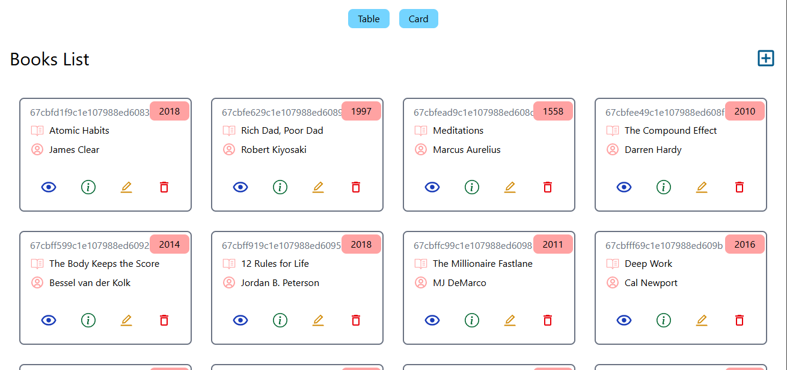
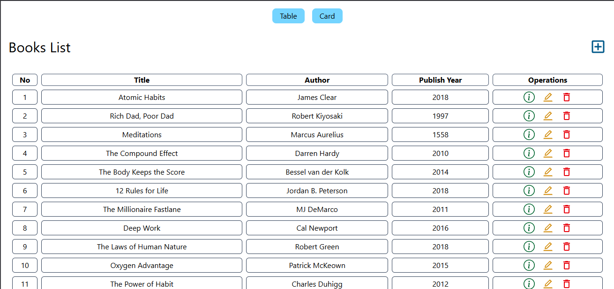

# Book Store MERN Stack Application

A full-stack web application for managing a book store built with the MERN stack (MongoDB, Express.js, React.js, Node.js).

## Features

- Book management (Add, Edit, Delete, View)
- User authentication
- Responsive design
- Modern UI/UX

## Tech Stack

- **Frontend**: React.js
- **Backend**: Node.js with Express.js
- **Database**: MongoDB
- **Dependencies**:
  - cors
  - dotenv
  - express
  - mongoose
  - nodemon

## Prerequisites

- Node.js (v14 or higher)
- MongoDB
- npm or yarn

## Installation

1. Clone the repository:
```bash
git clone https://github.com/wekesaoliver/week-4-integrating-the-mern-stack-wekesaoliver
cd book-store
```

2. Install dependencies:
```bash
npm install
```

3. Set up environment variables:
Create a `.env` file in the root directory and add the following:
```
MONGODB_URI=your_mongodb_connection_string
PORT=5000
```

4. Start the development server:
```bash
npm run dev
```

## Available Scripts

- `npm run dev`: Start the development server
- `npm run build`: Build the frontend for production
- `npm start`: Start the production server

## Project Structure

```
book-store/
├── frontend/          # React frontend application
├── backend/           # Node.js backend server
├── package.json       # Project dependencies and scripts
└── .env              # Environment variables
```

## Deployment

The application backend is deployed on render and frontend on vercel. You can access it at:
https://week-4-integrating-the-mern-stack-wekesaoliver.vercel.app/

## Screenshots

### Home Page


### Book Management


## Contributing

1. Fork the repository
2. Create your feature branch (`git checkout -b feature/AmazingFeature`)
3. Commit your changes (`git commit -m 'Add some AmazingFeature'`)
4. Push to the branch (`git push origin feature/AmazingFeature`)
5. Open a Pull Request

## License

This project is licensed under the ISC License.

## Author

Oliver Wekesa
